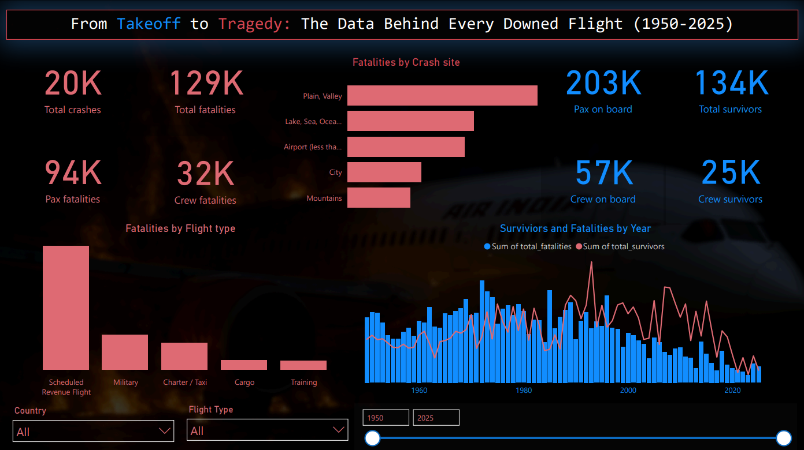
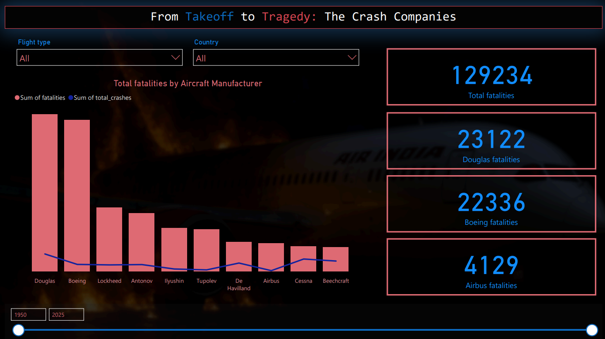
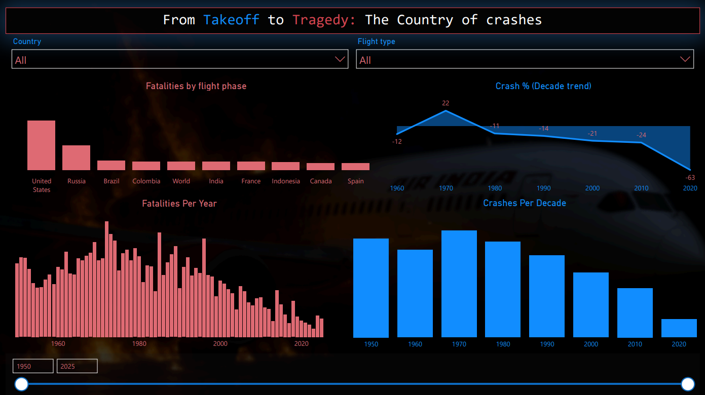

# ✈️ Aviation Crash Data Analysis (1950–2025)

This project analyses global aircraft crash data using **SQL** and **Power BI**.  
The analysis focuses on crash frequency, fatality patterns, manufacturer history, risk phases of flight, and aircraft age distribution.

---

## 📂 Project Structure

```
aviation-crash-analysis/
│
├── sql-scripts/
│   ├── 01_data_preparation.sql       # Data cleaning & transformation
│   └── 02_insight_generation.sql     # Exploratory analysis & view creation
│
├── Analysis-findings/
│   └── Aviation_Crash_Analysis_Report.pdf  # Summary of key insights
│
├── Dashboard/
│   └── Aviation_Crash_Analysis_Report.pdf  # Power BI visual report
│
├── Screenshots/
│   └── Dashboard/
│       ├── Page1ofdashboard.png
│       ├── Page2ofdashboard.png
│       └── Page3ofdashboard.png
```

---

## 📄 Reports

- 🔍 **Findings Report:**  
  [Analysis-findings/Aviation_Crash_Analysis_Report.pdf](Analysis-findings/Aviation_Crash_Analysis_Report.pdf)

- 📊 **Dashboard Report:**  
  [Dashboard/Aviation_Crash_Analysis_Report.pdf](Dashboard/Aviation_Crash_Analysis_Dashboard.pdf)

---

## 🛠 Tools Used

- **PostgreSQL** – used for data cleaning, transformation, and creation of analytical views  
- **Power BI** – used for designing interactive dashboards and visual storytelling

---

## 📈 Key Insights

- Total records analyzed: **19,796**
- Time period covered: **1950–2025**
- ✈️ Crashes peaked in the **1970s**, declined by over **83%** by the 2020s
- ☠️ Fatalities were highest in **1972 (3,354)**, lowest in **2023 (237)**
- 🏭 **Douglas** had the most recorded crashes  
- 🔥 **Airbus** had the highest average fatalities per crash  
- 🛫 Most fatal crashes occurred during **Takeoff and Landing** phases  

---

## 📷 Visual Insights

### 🔹 Dashboard Page 1 – From Takeoff to Tragedy


---

### 🔹 Dashboard Page 2 – The Crash Companies


---

### 🔹 Dashboard Page 3 – The Country of Crashes

